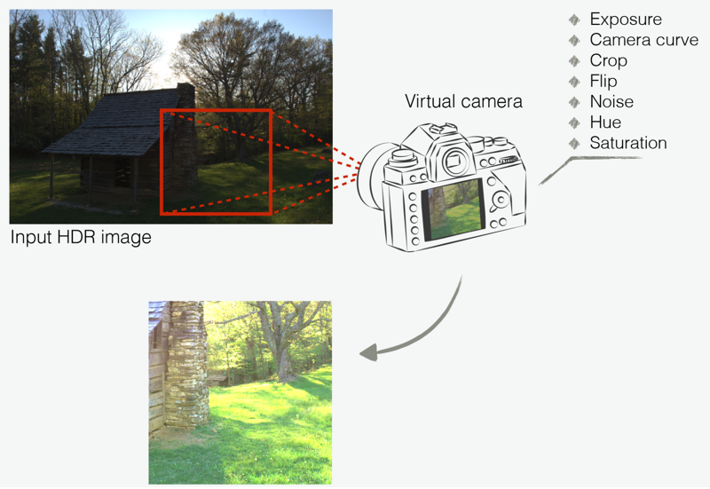
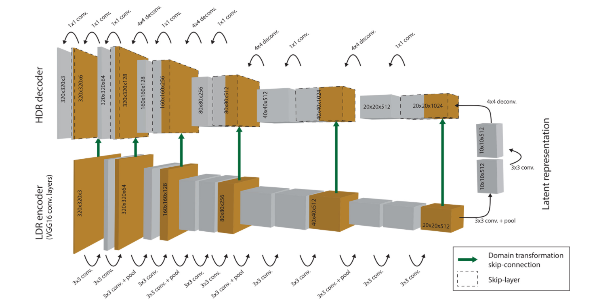
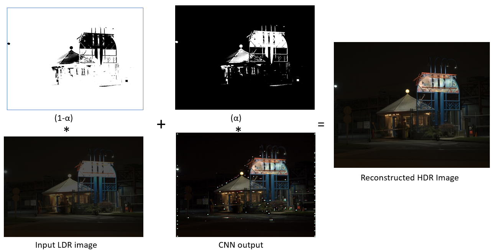
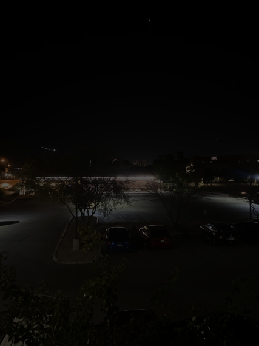
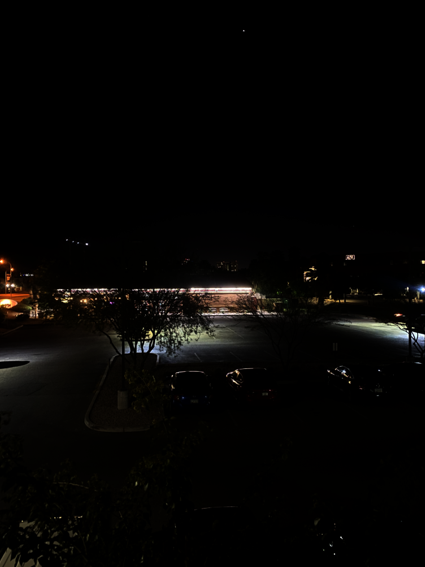

# Deep HDR Video Reconstruction Using Single Exposure

## Motivation
- Reconstruction of saturated image regions to recover lost information.
- HDR displays which are widely used everyday in the world use this technology.

## Data Augmentation
Realistic Camera Curve using sigmoid function.

## AutoEncoder Model Architecture
The model is a Convolutional Neural Network in form of a Hybrid Dynamic Range Encoder. VGG-16 architecture without any fully connected layers is used. Skip-Connection layers from encoder to decoder at each level of resolution. 

## Alpha-Blending
Prevents banding artifacts between predicted highlights and their surroundings. Keeps the input image unmodified in the non-saturated regions.

## Results
### Video

Input LDR Video          |        Reconstructed HDR Video
:-------------------------:|:-------------------------:
 | 

### Images

Input LDR Image          |        Reconstructed HDR Image
:-------------------------:|:-------------------------:
   |   

## References
[1] 
 
